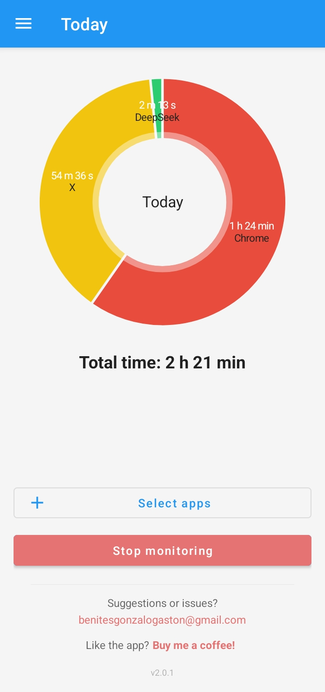
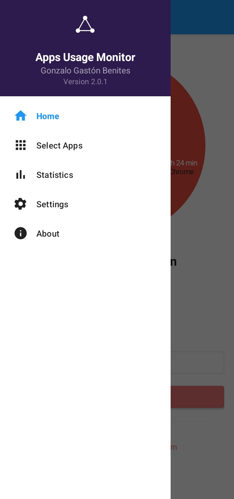
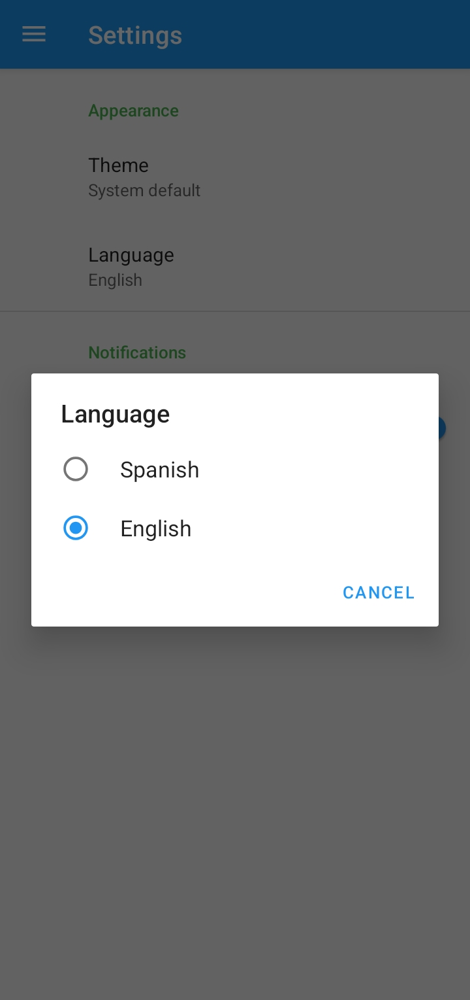

# 📱 Apps Usage Monitor

[](https://kotlinlang.org)
[](https://developer.android.com/studio/releases/gradle-plugin)
[](https://gradle.org)
[](https://android-arsenal.com/api?level=23)
[](LICENSE)
[](https://f-droid.org/packages/com.gnzalobnites.appsusagemonitor/)
[](https://apkpure.net/apps-usage-monitor/com.gnzalobnites.appsusagemonitor)

## 📋 Descripción

**Apps Usage Monitor** es una aplicación Android de código abierto que te ayuda a tomar conciencia del tiempo que pasas en tus aplicaciones. Mediante banners de conciencia temporal configurables y estadísticas detalladas, podrás gestionar mejor tu tiempo digital y reducir el uso excesivo del teléfono.

### ✨ Características Principales

- 🔔 **Banners de conciencia temporal**: Aparecen en el intervalo que configures (desde 10 segundos en modo DEMO)
- 👆 **Interacción intuitiva**: 1 click expande el banner, 2do click lo cierra
- 📊 **Estadísticas detalladas**: Gráficos circulares por aplicación con tiempos de uso
- 🎨 **Tema dinámico**: Los colores cambian según el tiempo que lleves usando la app
- 🔐 **Alta precisión**: Utiliza UsageStatsManager de Android para detectar la app en primer plano
- 🌙 **Tema oscuro/claro**: Persistente según tu preferencia
- 🧪 **Modo prueba**: Banners de prueba seguros sin afectar el monitoreo real
- 🌐 **Internacionalización**: Disponible en **español** e **inglés** (con detección automática del idioma del dispositivo)

## 🆕 Novedades de la Versión 1.2.4

- ✅ **Internacionalización completa**: Inglés como idioma por defecto + soporte nativo para español
- ✅ **Mejoras estéticas**: Íconos de banners rediseñados y UI más pulida
- ✅ **Corrección crítica**: Solucionado problema donde el banner bloqueaba eventos táctiles en la pantalla
- ✅ **Configuración moderna**: Actualizado a Android Gradle Plugin 8.4.0, Gradle 8.6 y Kotlin 1.9.23
- ✅ **SDK actualizado**: Compilado con SDK 34 (Android 14) para máxima compatibilidad
- ✅ **Fastlane**: Metadatos, capturas y descripciones en inglés y español

## 📸 Capturas de Pantalla

<div align="center">
  <table>
    <tr>
      <td></td>
      <td></td>
      <td></td>
	  <td></td>
    </tr>
    <tr>
      <td align="center"><b>Dashboard</b></td>
      <td align="center"><b>Estadísticas</b></td>
      <td align="center"><b>Banners de consciencia expandibles</b></td>
	  <td align="center"><b>Modo expandido</b></td>
    </tr>
  </table>
</div>

## 🚀 Instalación

### 📲 Desde tiendas de aplicaciones

| Plataforma | Enlace |
|------------|--------|
| **GitHub** | [app-release.apk](https://github.com/gnzalobnites/AppsUsageMonitor/releases/download/v1.2.4/app-release.apk) |
| **F-Droid** | Próximamente (pendiente de aprobación) |
| **APKPure** | [Apps Usage Monitor en APKPure](https://apkpure.net/apps-usage-monitor/com.gnzalobnites.appsusagemonitor) |

### 🔧 Requisitos

- Android 6.0 (API 23) o superior (por permisos de UsageStats)
- Permiso de accesibilidad (opcional, mejora la detección de apps)
- Permiso de overlay (para mostrar banners sobre otras apps)
- Permiso de datos de uso (para estadísticas precisas)

## 🛠️ Compilación desde Código Fuente

### Requisitos de desarrollo

- **Java JDK 17** o superior
- **Android SDK** (API 34 recomendado)
- **Gradle 8.6** (incluido en el wrapper)

### Pasos para compilar

```bash
# 1. Clona el repositorio
git clone https://github.com/gnzalobnites/AppsUsageMonitor.git
cd AppsUsageMonitor

# 2. Compila en modo debug
./gradlew assembleDebug

# 3. Para generar APK release (necesitas keystore propio)
./gradlew assembleRelease
