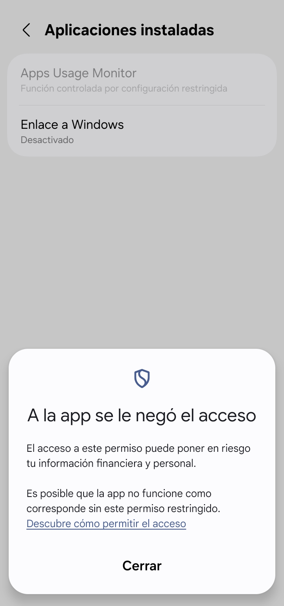
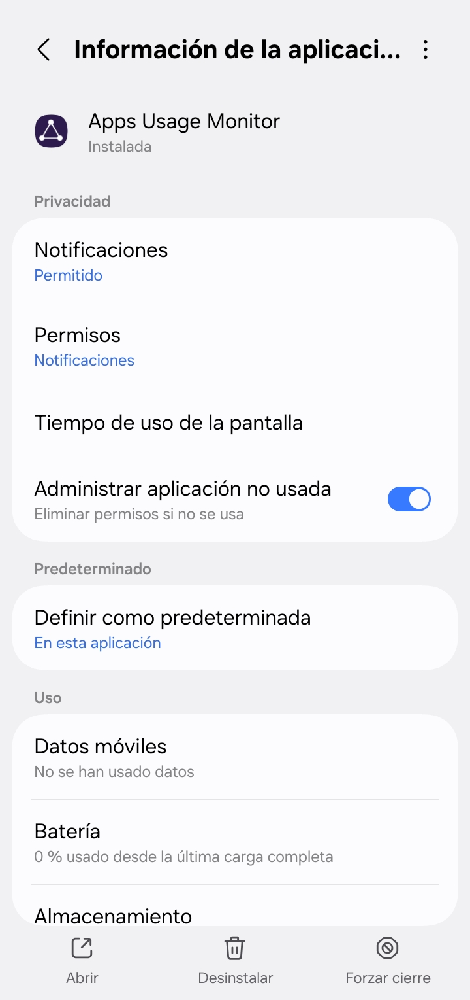
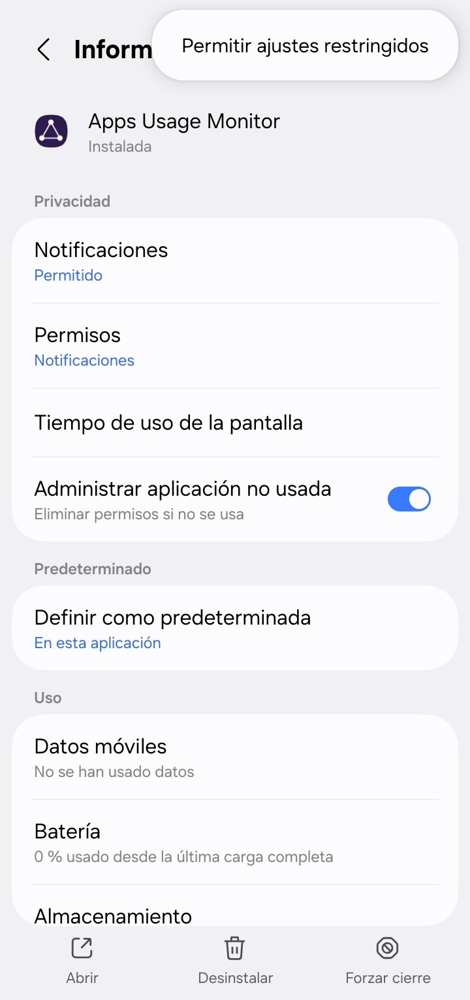
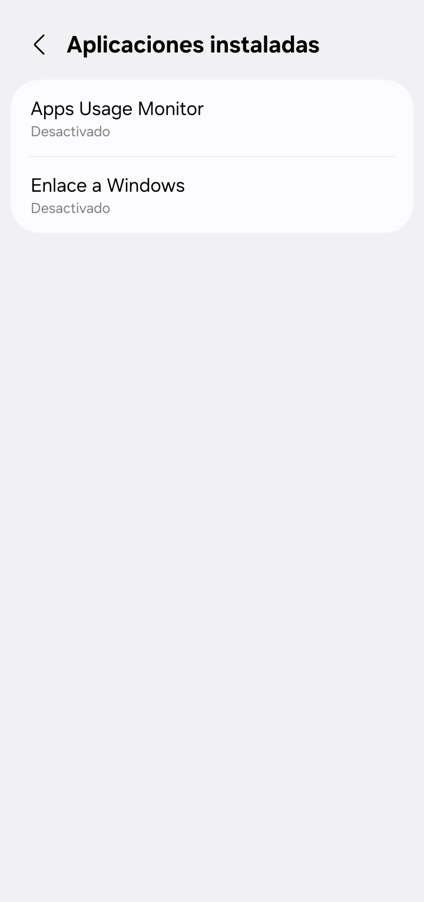
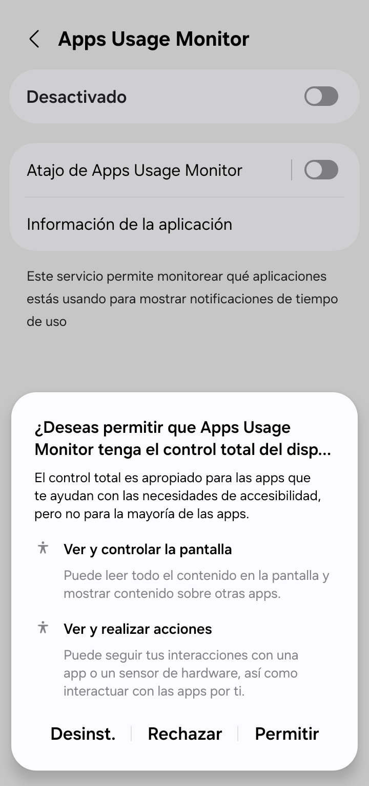
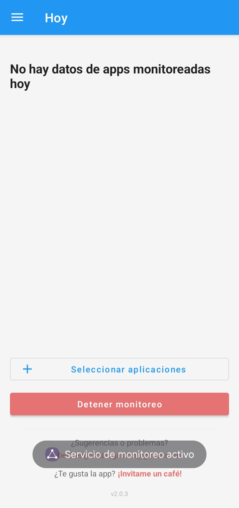

# 📱 Apps Usage Monitor

[](https://kotlinlang.org)
[](https://android-arsenal.com/api?level=23)
[](LICENSE)

## 📋 Descripción

**Apps Usage Monitor** es una aplicación de Android de código abierto diseñada para ayudarte a tomar conciencia y controlar el tiempo que pasas en tus aplicaciones. En un mundo lleno de distracciones digitales, esta herramienta te proporciona la información y los recordatorios visuales necesarios para fomentar un uso más consciente y saludable de tu teléfono.

Mediante **banners de conciencia temporal** que aparecen en intervalos configurables y **estadísticas detalladas** de uso, podrás identificar patrones, gestionar mejor tu tiempo digital y reducir el uso excesivo de aplicaciones.

## ✨ Características Principales

- **⏱️ Banners de Conciencia Temporal:** Recibe recordatorios visuales no intrusivos en forma de burbuja flotante. Aparecen en el intervalo que configures para cada aplicación (ej. 1 minuto, 5 minutos, 1 hora).
- **📊 Panel Principal con Gráfico Circular:** Visualiza de un vistazo el tiempo de uso de hoy de tus aplicaciones monitoreadas en un atractivo gráfico circular.
- **📈 Estadísticas Históricas Detalladas:** Consulta el uso diario de los últimos 7 días para cualquier aplicación que hayas monitoreado, presentado en un claro gráfico de barras.
- **💡 Banner Expandible:** Toca la burbuja flotante para expandirla y ver información detallada de la sesión actual en tiempo real, así como el tiempo total acumulado en el día. Un segundo toque la vuelve a contraer.
- **🎯 Configuración por Aplicación:** Selecciona exactamente qué aplicaciones deseas monitorear y define un intervalo de notificación personalizado para cada una de ellas.
- **⚙️ Modo Claro/Oscuro:** La aplicación se adapta a tu preferencia, con soporte completo para temas claro y oscuro, incluyendo la detección automática de la configuración del sistema.
- **🌐 Internacionalización:** Disponible en múltiples idiomas (Español e Inglés) para una mejor experiencia de usuario.
- **🔒 Privacidad y Datos Locales:** Todo el historial de sesiones se almacena de forma segura y privada en tu dispositivo utilizando **Room Database**. No se envía ningún dato a servidores externos.
- **🛡️ Arquitectura Robusta:** Construida siguiendo los principios de **Arquitectura Limpia y MVVM** (Model-View-ViewModel) para garantizar un código mantenible, escalable y libre de errores.

## 📸 Capturas de Pantalla

<div align="center">
  <table>
    <tr>
      <td></td>
      <td></td>
      <td></td>
    </tr>
    <tr>
      <td align="center"><b>Dashboard con gráfico circular</b></td>
      <td align="center"><b>Selección de aplicaciones</b></td>
      <td align="center"><b>Banner de conciencia</b></td>
    </tr>
    <tr>
      <td></td>
      <td></td>
      <td></td>
    </tr>
    <tr>
      <td align="center"><b>Banner expandido con tiempos</b></td>
      <td align="center"><b>Estadísticas históricas</b></td>
      <td align="center"><b>Ajustes de tema e idioma</b></td>
    </tr>
  </table>
</div>

## 🚀 Primeros Pasos

### Requisitos del Sistema

- Android 6.0 (API nivel 23) o superior.

### Permisos Necesarios

Para que Apps Usage Monitor funcione correctamente, necesita los siguientes permisos:

1.  **Permiso de Datos de Uso (UsageStats):** **Obligatorio.** Permite a la aplicación leer las estadísticas de tiempo de uso de otras aplicaciones.
2.  **Permiso de Superposición (Overlay):** **Obligatorio.** Necesario para dibujar los banners flotantes sobre otras aplicaciones.
3.  **Permiso de Notificaciones (Android 13+):** **Recomendado.** Permite que el servicio de monitoreo se ejecute en segundo plano de manera eficiente.
4.  **Servicio de Accesibilidad:** **Recomendado para máxima precisión.** Mejora significativamente la detección de cuándo cambias de una aplicación a otra, asegurando que los tiempos de sesión sean exactos.

### 📸 Guía para permisos en Android 13+

En Android 13 y versiones posteriores, debido a políticas de seguridad más estrictas para aplicaciones instaladas fuera de Google Play, es posible que necesites seguir estos pasos adicionales para habilitar el **Servicio de Accesibilidad**:

<div align="center">
  <table>
    <tr>
      <td></td>
      <td></td>
      <td></td>
    </tr>
    <tr>
      <td align="center"><b>1. Aparecerá una advertencia. Ciérrala.</b></td>
      <td align="center"><b>2. Ve a Ajustes > Apps > Apps Usage Monitor y toca el menú ⋮</b></td>
      <td align="center"><b>3. Activa "Ajustes restringidos"</b></td>
    </tr>
    <tr>
      <td></td>
      <td></td>
      <td></td>
    </tr>
    <tr>
      <td align="center"><b>4. Se habilitará el otorgamiento del permiso.</b></td>
      <td align="center"><b>5. Otórgale el permiso a la app</b></td>
      <td align="center"><b>6. El monitoreo se activará.</b></td>
    </tr>
  </table>
</div>

## 🛠️ Compilación desde el Código Fuente

¿Te interesa el desarrollo? ¡Puedes compilar la aplicación tú mismo!

### Prerrequisitos

- **Android Studio** (Hedgehog o superior recomendado)
- **JDK 17** o superior
- **Android SDK** (API nivel 34 recomendado)

### Pasos

1.  **Clona el repositorio:**
    ```bash
    git clone https://github.com/gnzalobnites/AppsUsageMonitor.git
    cd AppsUsageMonitor
    ```

2.  **Compila la aplicación:**
    - Para generar un APK de depuración (debug):
        ```bash
        ./gradlew assembleDebug
        ```
    - Para generar un APK de distribución (release), necesitarás crear un archivo `keystore.properties` en la raíz del proyecto con las credenciales de tu keystore. Luego ejecuta:
        ```bash
        ./gradlew assembleRelease
        ```

El APK generado se encontrará en la carpeta `app/build/outputs/apk/`.

## 🧠 Arquitectura del Proyecto

El proyecto está estructurado siguiendo los principios de **Arquitectura Limpia y MVVM** para garantizar la separación de responsabilidades y la facilidad de prueba.

```
app/
├── src/main/java/com/gnzalobnites/appsusagemonitor/
│   ├── data/               # Capa de datos
│   │   ├── database/        # Room Database, DAOs y Converters
│   │   ├── entities/        # Entidades de la base de datos (MonitoredApp, UsageSession)
│   │   ├── model/           # Modelos de datos simples (UsageStat)
│   │   └── repository/      # Repositorios que abstraen las fuentes de datos (DB y UsageStatsManager)
│   ├── service/             # Servicios en primer plano
│   │   ├── MonitoringService.kt  # Servicio de Accesibilidad para detección de apps
│   │   └── BubbleService.kt      # Servicio de Overlay para mostrar los banners
│   ├── ui/                  # Capa de presentación (Vistas y ViewModels)
│   │   ├── about/           # Fragmento "Acerca de"
│   │   ├── adapters/        # Adaptadores para RecyclerViews
│   │   ├── main/            # Fragmento principal y su ViewModel
│   │   ├── selection/       # Fragmento de selección de apps y su ViewModel
│   │   ├── settings/        # Fragmento de configuración (PreferenceFragment)
│   │   └── stats/           # Fragmento de estadísticas y su ViewModel
│   └── utils/               # Clases de utilidad (Constants, PermissionHelper, etc.)
└── src/main/res/            # Recursos (layouts, drawables, strings, temas)
```

## 🤝 Contribuciones

¡Las contribuciones son siempre bienvenidas! Si tienes una idea para mejorar la aplicación, por favor:

1.  Haz un **fork** del repositorio.
2.  Crea una nueva rama para tu funcionalidad (`git checkout -b feature/AmazingFeature`).
3.  Haz **commit** de tus cambios (`git commit -m 'Add some AmazingFeature'`).
4.  Haz **push** a la rama (`git push origin feature/AmazingFeature`).
5.  Abre un **Pull Request**.

## 📄 Licencia

Este proyecto está licenciado bajo la **GNU General Public License v3.0**. Consulta el archivo [LICENSE](LICENSE) para más detalles.

## 📬 Contacto y Apoyo

**Desarrollador:** Gonzalo Gastón Benites

- **Correo:** [benitesgonzalogaston@gmail.com](mailto:benitesgonzalogaston@gmail.com)
- **GitHub:** [@gnzalobnites](https://github.com/gnzalobnites)

Si esta aplicación te resulta útil y quieres apoyar su desarrollo, ¡puedes invitarme un café!

[](https://buymeacoffee.com/gnzbenitesh)

---
**¡Descarga Apps Usage Monitor y toma el control de tu tiempo digital!** 🚀