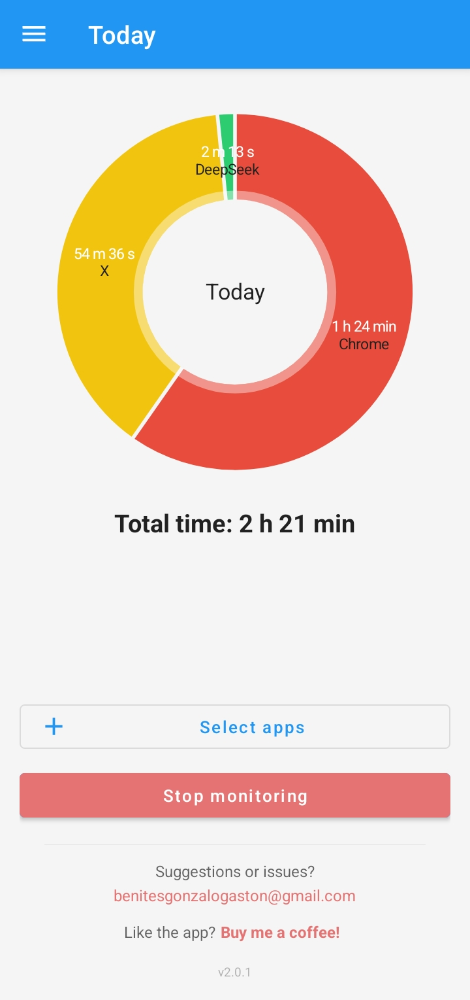
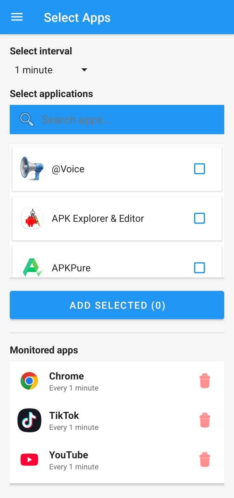
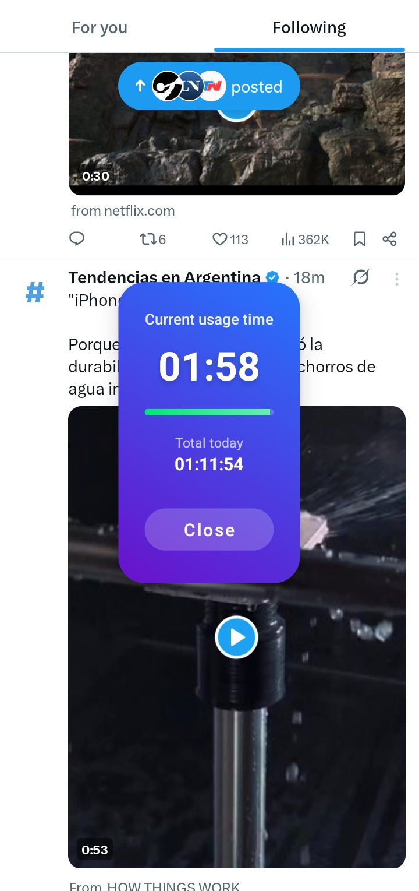
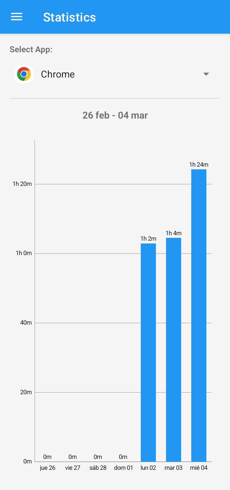
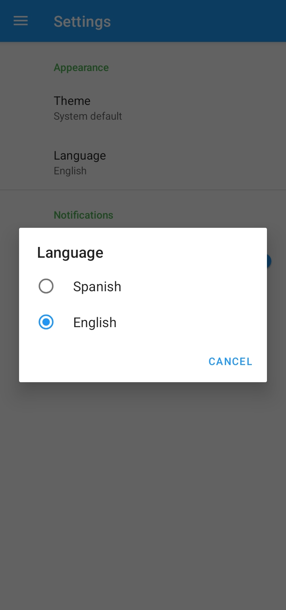

📱 Apps Usage Monitor - Versión 2.0.3

He actualizado tu README para reflejar los cambios tras la reescritura completa de la aplicación:

---

📱 Apps Usage Monitor

[](https://kotlinlang.org)
[](https://developer.android.com/studio/releases/gradle-plugin)
[](https://gradle.org)
[](https://android-arsenal.com/api?level=23)
[](LICENSE)
[](https://f-droid.org/packages/com.gnzalobnites.appsusagemonitor/)
[](https://apkpure.net/apps-usage-monitor/com.gnzalobnites.appsusagemonitor)

📋 Descripción

Apps Usage Monitor es una aplicación Android de código abierto que te ayuda a tomar conciencia del tiempo que pasas en tus aplicaciones. Mediante banners de conciencia temporal configurables y estadísticas detalladas, podrás gestionar mejor tu tiempo digital y reducir el uso excesivo del teléfono.

✨ Características Principales

- 🔔 Banners de conciencia temporal: Aparecen en el intervalo que configures para cada aplicación (10s, 1m, 5m, 15m, 30m, 1h)
- 📊 Estadísticas en tiempo real: Gráfico circular que muestra el uso de hoy de tus apps monitoreadas
- ⏱️ Contador de sesión actual: Al expandir el banner, ves el tiempo de la sesión actual y el total del día
- 👆 Interacción intuitiva: Un click expande el banner mostrando tiempos detallados, otro click lo cierra
- 🎯 Monitoreo por app: Selecciona exactamente qué aplicaciones quieres monitorear, cada una con su propio intervalo
- 📈 Estadísticas históricas: Gráfico de barras con el uso diario de los últimos 7 días por aplicación
- 🔐 Persistencia de datos: Historial completo de sesiones guardado localmente con Room Database
- 🌙 Tema oscuro/claro: Configurable desde ajustes, con detección automática del sistema
- 🌐 Internacionalización: Disponible en español e inglés con detección automática
- 🧠 Detección inteligente: Maneja paquetes del sistema, teclados y gestos para no interrumpir la experiencia


🆕 Novedades de la Versión 2.0.3 (Reescritura Completa)

- ✅ Arquitectura robusta: Reescritura completa con Room Database para almacenamiento persistente
- ✅ Banners persistentes: Ahora los banners permanecen visibles y se actualizan en tiempo real
- ✅ Estadísticas reales: Los gráficos muestran datos reales de la base de datos, no simulaciones
- ✅ Fragmento de estadísticas: Nuevo gráfico de barras con historial de 7 días por aplicación
- ✅ Gestión de apps monitoreadas: Interfaz mejorada para agregar/quitar apps con búsqueda en tiempo real
- ✅ Mejora en permisos: Verificación y solicitud inteligente de permisos (UsageStats, Overlay, Notificaciones)
- ✅ Servicio de accesibilidad optimizado: Detección más precisa de cambios de aplicación
- ✅ Caché de nombres de apps: Mejor rendimiento al mostrar estadísticas
- ✅ Actualización automática: Los datos se recargan al cambiar de día
- ✅ Footer integrado: Enlaces a email, invitación a café y versión directamente en pantalla principal
- ✅ Correcciones críticas: Solucionados problemas de fugas de memoria, NullPointerException y manejo de ciclos de vida

📸 Capturas de Pantalla

<div align="center">
  <table>
    <tr>
      <td></td>
      <td></td>
      <td></td>
    </tr>
    <tr>
      <td align="center"><b>Dashboard con gráfico circular</b></td>
      <td align="center"><b>Selección de aplicaciones</b></td>
      <td align="center"><b>Banner de conciencia</b></td>
    </tr>
    <tr>
      <td></td>
      <td></td>
      <td></td>
    </tr>
    <tr>
      <td align="center"><b>Banner expandido con tiempos</b></td>
      <td align="center"><b>Estadísticas históricas</b></td>
      <td align="center"><b>Ajustes de tema e idioma</b></td>
    </tr>
  </table>
</div>

🚀 Instalación

📲 Desde tiendas de aplicaciones

| Plataforma | Enlace |
| --- | --- |
| GitHub | [AppsUsageMonitor-v2.0.3.apk](https://github.com/gnzalobnites/AppsUsageMonitor/releases/download/v2.0.3/AppsUsageMonitor-v2.0.3.apk) |
| F-Droid | Próximamente |
| APKPure | [Apps Usage Monitor en APKPure](https://apkpure.com/p/com.gnzalobnites.appsusagemonitor) |

🔧 Requisitos

- Android 6.0 (API 23) o superior
- Permiso de datos de uso (UsageStats) - Obligatorio para estadísticas
- Permiso de superposición (Overlay) - Necesario para mostrar banners
- Permiso de notificaciones (Android 13+) - Para servicio en segundo plano
- Servicio de accesibilidad (Opcional pero recomendado) - Mejora la precisión

🛠️ Compilación desde Código Fuente

Requisitos de desarrollo

- Java JDK 17 o superior
- Android Studio Hedgehog (2023.1.1) o superior
- Android SDK (API 34 recomendado)
- Gradle 8.6 (incluido)

Pasos para compilar

```bash
# 1. Clona el repositorio
git clone https://github.com/gnzalobnites/AppsUsageMonitor.git
cd AppsUsageMonitor

# 2. Entra a la rama dev
git checkout dev

# 3. Compila en modo debug
./gradlew assembleDebug

# 4. Para generar APK release (necesitas keystore propio)
# Crea un archivo keystore.properties en la raíz con:
# storeFile=../tu-keystore.jks
# storePassword=tu-password
# keyAlias=tu-alias
# keyPassword=tu-password-key
./gradlew assembleRelease
```

📁 Estructura del Proyecto

```
app/
├── src/main/java/com/gnzalobnites/appsusagemonitor/
│   ├── data/               # Capa de datos
│   │   ├── database/        # Room Database, DAOs, Converters
│   │   ├── entities/        # Entidades (MonitoredApp, UsageSession)
│   │   ├── model/           # Modelos de datos (UsageStat)
│   │   └── repository/      # Repositorios (AppRepository, UsageRepository)
│   ├── service/             # Servicios en primer plano
│   │   ├── MonitoringService.kt  # Servicio de accesibilidad
│   │   └── BubbleService.kt      # Servicio de banners overlay
│   ├── ui/                  # Capa de presentación
│   │   ├── about/           # Fragmento Acerca de
│   │   ├── adapters/        # Adaptadores de RecyclerView
│   │   ├── main/            # Fragmento principal y ViewModel
│   │   ├── selection/       # Selección de apps y ViewModel
│   │   ├── settings/        # Fragmento de configuración
│   │   └── stats/           # Estadísticas y ViewModel
│   └── utils/               # Utilidades (Constants, PermissionHelper)
└── src/main/res/
    ├── layout/              # Layouts XML
    ├── drawable/             # Recursos gráficos
    ├── values/               # Strings, colores, temas
    └── menu/                 # Menú del drawer
```

🧠 Arquitectura

La aplicación sigue principios de Arquitectura Limpia y MVVM:

- Room Database: Almacenamiento local de sesiones y apps monitoreadas
- ViewModel + LiveData/Flow: Comunicación reactiva con la UI
- Repositorios: Abstracción de fuentes de datos (DB + UsageStatsManager)
- Servicios: Componentes en primer plano con notificaciones
- ViewBinding: Binding seguro y eficiente de vistas

🤝 Contribuciones

Las contribuciones son bienvenidas. Por favor:

1. Haz fork del proyecto
2. Crea una rama para tu feature (git checkout -b feature/AmazingFeature)
3. Commit tus cambios (git commit -m 'Add some AmazingFeature')
4. Push a la rama (git push origin feature/AmazingFeature)
5. Abre un Pull Request

📄 Licencia

Este proyecto está licenciado bajo GNU General Public License v3.0 - ver el archivo LICENSE para más detalles.

📬 Contacto

Desarrollador: Gonzalo Benites

- Email: benitesgonzalogaston@gmail.com
- GitHub: [@gnzalobnites](https://github.com/gnzalobnites)
- Buy Me a Coffee: https://buymeacoffee.com/gnzbenitesh

---

¡Si te gusta la aplicación, considera invitarme un café! ☕

---

📊 Comparativa de Versiones


| Característica | v1.2.4 |  v2.0.3 (Nueva) |
| --- | --- | --- |
| Base de datos | ❌ No persistente | ✅ Room Database |
| Historial por app | ❌ No | ✅ 7 días |
| Banners persistentes | ❌ Se cerraban solos | ✅ Permanecen visibles |
| Tiempo real en banner | ❌ No | ✅ Sí |
| Múltiples intervalos | ❌ Global | ✅ Por app |
| Búsqueda de apps | ❌ No | ✅ Sí |
| Footer integrado | ❌ No | ✅ Sí |
| Manejo de exenciones | ❌ Básico | ✅ Avanzado |

---

Descarga la última versión y toma el control de tu tiempo digital 🚀
